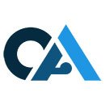

# OAN Booth Game — Local Setup

## Quick start
1. Copy `game.html` to any folder on your laptop/PC
2. Put your logo file in the same folder (default name: `oappsnet-logo.png`)
3. Open `game.html` in Chrome or Edge — no server needed
4. Use the font size slider (top-right gear icon) to adjust for your screen

## Logo setup
The game looks for the logo at a relative path. By default:
  

To use a different filename, open game.html in a text editor and change:
  src="oappsnet-logo.png"
to your actual filename, e.g.:
  src="130by130.png"

## Font size control
A gear icon (⚙) appears fixed in the top-right corner.
Click it to reveal a slider from 80% to 200% scale.
The setting persists while the page is open.
On a 32" 4K monitor, try 140–160%.

## Files
  game.html     — the complete self-contained game
  README.md     — this file
# OAN Booth Game
